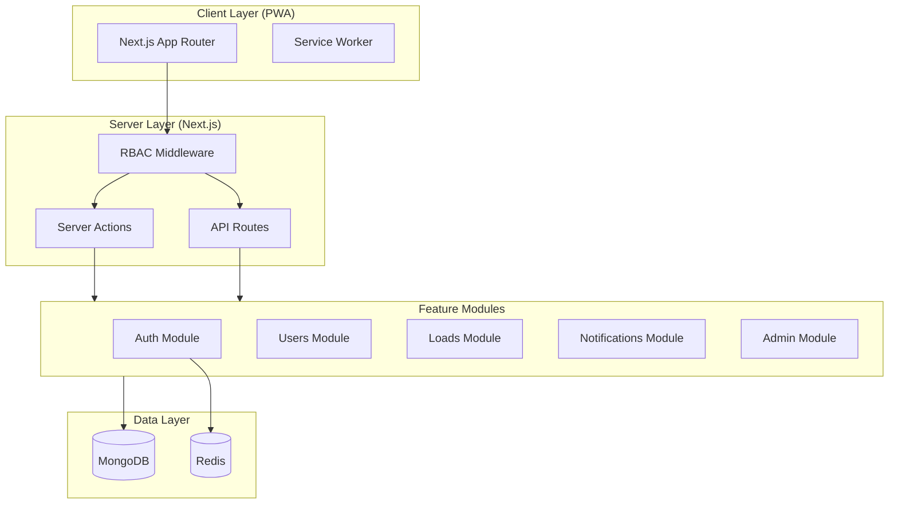
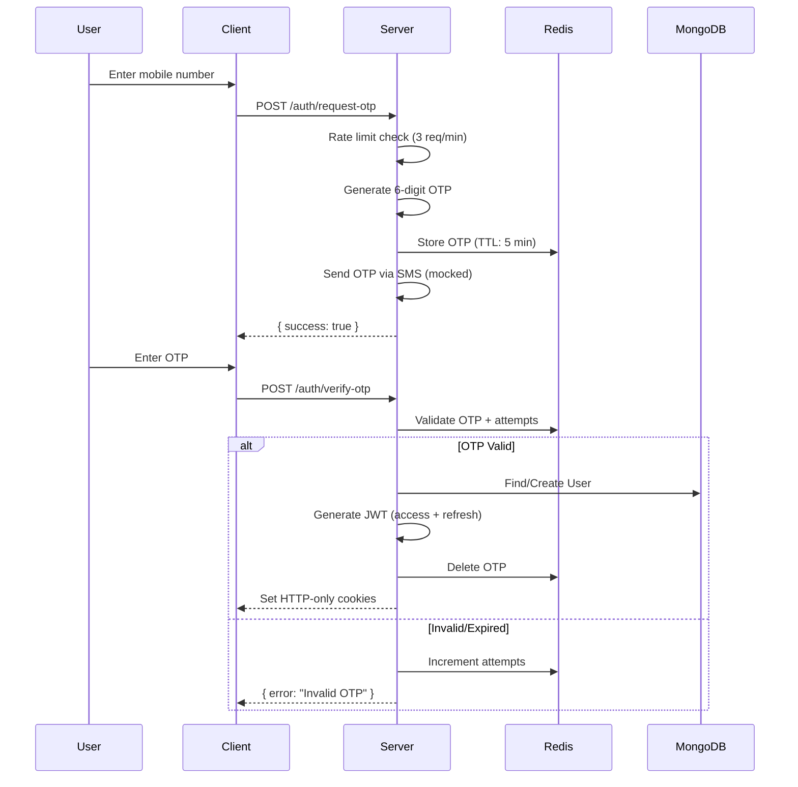

# NTruck MVP - Production Architecture & Implementation Plan

## Executive Summary

NTruck is a logistics marketplace connecting Shippers (load posters) with Drivers (load acceptors). This document outlines the complete architecture for a production-grade, deployable MVP following clean architecture principles.

---

## 1. High-Level Architecture



### Architecture Decisions

| Decision | Rationale | Trade-offs |
|----------|-----------|------------|
| **Monorepo with `apps/web`** | Prepares for future mobile apps, shared packages | Slightly more complex initial setup |
| **Server Actions over API Routes** | Type-safe, colocated, automatic optimizations | Less RESTful, harder to share with mobile |
| **Feature-based modules** | High cohesion, easy to navigate, scalable | More files, requires discipline |
| **Repository pattern** | Testable, database-agnostic, clean separation | Additional abstraction layer |

---

## 2. Project Structure

```
ntruck/
├── apps/
│   └── web/
│       ├── app/                          # Next.js App Router
│       │   ├── (auth)/                   # Auth route group
│       │   │   ├── login/
│       │   │   └── verify-otp/
│       │   ├── (dashboard)/              # Protected routes
│       │   │   ├── shipper/
│       │   │   ├── driver/
│       │   │   └── admin/
│       │   ├── api/                      # API routes (minimal)
│       │   ├── layout.tsx
│       │   └── page.tsx
│       │
│       ├── modules/                      # Feature modules
│       │   ├── auth/
│       │   │   ├── actions/              # Server actions
│       │   │   ├── services/             # Business logic
│       │   │   ├── repositories/         # Data access
│       │   │   ├── schemas/              # Zod schemas
│       │   │   └── types/
│       │   ├── users/
│       │   ├── loads/
│       │   ├── notifications/
│       │   └── admin/
│       │
│       ├── components/                   # Shared UI components
│       │   ├── ui/                       # Base components
│       │   └── layouts/                  # Layout components
│       │
│       ├── lib/                          # Core utilities
│       │   ├── db/                       # Database connections
│       │   ├── redis/                    # Redis client
│       │   ├── auth/                     # JWT utilities
│       │   ├── errors/                   # Error classes
│       │   ├── logger/                   # Structured logging
│       │   └── utils/                    # Helpers
│       │
│       ├── db/                           # Database models
│       │   ├── models/
│       │   └── plugins/                  # Mongoose plugins
│       │
│       ├── types/                        # Global types
│       ├── config/                       # App configuration
│       ├── middleware.ts                 # Next.js middleware
│       └── public/
│           └── manifest.json             # PWA manifest
```

---

## 3. Data Models

### 3.1 Base Schema Pattern

All models include audit fields and soft delete support:

```typescript
// Base fields applied to all models
interface BaseDocument {
  _id: ObjectId;
  createdAt: Date;
  updatedAt: Date;
  createdBy: ObjectId | null;
  deletedAt: Date | null;  // Soft delete
  isDeleted: boolean;
}
```

### 3.2 User Model

```typescript
interface User extends BaseDocument {
  mobile: string;           // Unique, indexed
  countryCode: string;      // Default: +91
  role: 'SHIPPER' | 'DRIVER' | 'ADMIN';
  status: 'ACTIVE' | 'SUSPENDED' | 'PENDING_VERIFICATION';
  lastLoginAt: Date | null;
  
  // Denormalized for performance
  profile: {
    name: string;
    email?: string;
    avatar?: string;
  };
}
```

### 3.3 DriverProfile Model

```typescript
interface DriverProfile extends BaseDocument {
  userId: ObjectId;         // Reference to User
  vehicleType: 'TRUCK_SMALL' | 'TRUCK_MEDIUM' | 'TRUCK_LARGE' | 'TRAILER';
  vehicleNumber: string;
  licenseNumber: string;
  licenseExpiry: Date;
  
  // Operational data
  currentLocation?: {
    type: 'Point';
    coordinates: [number, number];  // [lng, lat]
  };
  isAvailable: boolean;
  
  // Verification
  documents: {
    type: 'LICENSE' | 'RC' | 'INSURANCE' | 'PAN';
    url: string;
    verified: boolean;
    verifiedAt?: Date;
  }[];
}
```

### 3.4 ShipperProfile Model

```typescript
interface ShipperProfile extends BaseDocument {
  userId: ObjectId;         // Reference to User
  companyName: string;
  gstin?: string;           // GST number
  address: {
    line1: string;
    line2?: string;
    city: string;
    state: string;
    pincode: string;
  };
  
  // Verification
  verified: boolean;
  verifiedAt?: Date;
}
```

### 3.5 Load Model

```typescript
interface Load extends BaseDocument {
  shipperId: ObjectId;      // Reference to User (shipper)
  driverId?: ObjectId;      // Reference to User (driver)
  
  // Load details
  loadNumber: string;       // Unique, auto-generated (NT-YYYYMMDD-XXXX)
  
  pickup: {
    address: string;
    city: string;
    state: string;
    pincode: string;
    coordinates?: {
      type: 'Point';
      coordinates: [number, number];
    };
    contactName: string;
    contactPhone: string;
    scheduledAt: Date;
  };
  
  drop: {
    address: string;
    city: string;
    state: string;
    pincode: string;
    coordinates?: {
      type: 'Point';
      coordinates: [number, number];
    };
    contactName: string;
    contactPhone: string;
  };
  
  // Cargo details
  cargo: {
    type: string;           // e.g., "Electronics", "FMCG"
    weight: number;         // in kg
    description?: string;
  };
  
  // Pricing
  price: number;            // in INR
  
  // Status tracking
  status: 'DRAFT' | 'POSTED' | 'ACCEPTED' | 'IN_TRANSIT' | 'DELIVERED' | 'CANCELLED';
  statusHistory: {
    status: string;
    changedAt: Date;
    changedBy: ObjectId;
    notes?: string;
  }[];
  
  acceptedAt?: Date;
  deliveredAt?: Date;
}
```

### 3.6 Notification Model

```typescript
interface Notification extends BaseDocument {
  userId: ObjectId;         // Target user
  type: 'LOAD_POSTED' | 'LOAD_ACCEPTED' | 'LOAD_STATUS' | 'SYSTEM';
  title: string;
  message: string;
  data?: Record<string, unknown>;  // Additional context
  read: boolean;
  readAt?: Date;
}
```

### 3.7 AuditLog Model

```typescript
interface AuditLog {
  _id: ObjectId;
  createdAt: Date;
  
  // Actor
  userId: ObjectId | null;  // null for system actions
  userRole: string;
  
  // Action
  action: 'CREATE' | 'UPDATE' | 'DELETE' | 'LOGIN' | 'LOGOUT' | 'STATUS_CHANGE';
  resource: 'USER' | 'LOAD' | 'PROFILE' | 'SESSION';
  resourceId: ObjectId;
  
  // Context
  changes?: {
    field: string;
    oldValue: unknown;
    newValue: unknown;
  }[];
  metadata?: Record<string, unknown>;
  ipAddress?: string;
  userAgent?: string;
}
```

---

## 4. Authentication Flow

### 4.1 OTP-Based Login Flow



### 4.2 JWT Strategy

| Token | Purpose | Expiry | Storage |
|-------|---------|--------|---------|
| **Access Token** | API authorization | 15 minutes | HTTP-only cookie |
| **Refresh Token** | Token rotation | 7 days | HTTP-only cookie |

### 4.3 OTP Rules

- **Length**: 6 digits
- **Expiry**: 5 minutes
- **Max attempts**: 3 (after which OTP is invalidated)
- **Rate limit**: 3 OTP requests per phone per 10 minutes
- **Cooldown**: 60 seconds between requests

---

## 5. RBAC (Role-Based Access Control)

### 5.1 Permission Matrix

| Resource | Action | SHIPPER | DRIVER | ADMIN |
|----------|--------|---------|--------|-------|
| **Loads** | Create | ✅ | ❌ | ✅ |
| **Loads** | View Own | ✅ | ✅ | ✅ |
| **Loads** | View Available | ❌ | ✅ | ✅ |
| **Loads** | Accept | ❌ | ✅ | ❌ |
| **Loads** | Update Status | ✅ | ✅ | ✅ |
| **Users** | View Own Profile | ✅ | ✅ | ✅ |
| **Users** | View All | ❌ | ❌ | ✅ |
| **Users** | Suspend | ❌ | ❌ | ✅ |
| **Notifications** | View Own | ✅ | ✅ | ✅ |
| **Audit Logs** | View | ❌ | ❌ | ✅ |

### 5.2 Middleware Implementation

```typescript
// Enforced at three levels:
// 1. Route level (middleware.ts) - Redirect unauthorized
// 2. Server Actions - Throw UnauthorizedError
// 3. Repository level - Filter by ownership
```

---

## 6. Feature Module Details

### 6.1 Auth Module

#### Server Actions
| Action | Input | Output |
|--------|-------|--------|
| `requestOtp` | mobile, countryCode | success, cooldownSeconds |
| `verifyOtp` | mobile, otp | user, redirectTo |
| `logout` | - | success |
| `refreshSession` | - | newAccessToken |

---

### 6.2 Loads Module

#### Server Actions (Shipper)
| Action | Input | Output |
|--------|-------|--------|
| `createLoad` | LoadCreateInput | Load |
| `updateLoad` | loadId, LoadUpdateInput | Load |
| `cancelLoad` | loadId, reason | Load |
| `getMyLoads` | filters, pagination | PagedLoads |

#### Server Actions (Driver)
| Action | Input | Output |
|--------|-------|--------|
| `getAvailableLoads` | filters, pagination | PagedLoads |
| `acceptLoad` | loadId | Load |
| `updateLoadStatus` | loadId, status | Load |
| `getMyAcceptedLoads` | filters, pagination | PagedLoads |

---

### 6.3 Notifications Module

#### Server Actions
| Action | Input | Output |
|--------|-------|--------|
| `getNotifications` | pagination | PagedNotifications |
| `markAsRead` | notificationId | Notification |
| `markAllAsRead` | - | count |
| `getUnreadCount` | - | number |

---

### 6.4 Admin Module

#### Server Actions
| Action | Input | Output |
|--------|-------|--------|
| `getAllUsers` | filters, pagination | PagedUsers |
| `getUserDetails` | userId | User + Profile |
| `suspendUser` | userId, reason | User |
| `getAllLoads` | filters, pagination | PagedLoads |
| `getAuditLogs` | filters, pagination | PagedAuditLogs |
| `getDashboardStats` | - | DashboardStats |

---

## 7. Frontend Structure

### 7.1 Route Groups

```
app/
├── (auth)/                 # Unauthenticated routes
│   ├── login/
│   │   └── page.tsx
│   └── verify-otp/
│       └── page.tsx
│
├── (dashboard)/            # Protected routes
│   ├── layout.tsx          # Dashboard shell with nav
│   │
│   ├── shipper/
│   │   ├── page.tsx        # Dashboard home
│   │   ├── loads/
│   │   │   ├── page.tsx    # My loads list
│   │   │   ├── new/
│   │   │   │   └── page.tsx
│   │   │   └── [id]/
│   │   │       └── page.tsx
│   │   └── profile/
│   │       └── page.tsx
│   │
│   ├── driver/
│   │   ├── page.tsx        # Available loads
│   │   ├── my-loads/
│   │   │   └── page.tsx    # Accepted loads
│   │   └── profile/
│   │       └── page.tsx
│   │
│   └── admin/
│       ├── page.tsx        # Dashboard
│       ├── users/
│       ├── loads/
│       └── audit-logs/
```

### 7.2 UI Components

| Component | Purpose |
|-----------|---------|
| `Button` | Primary, secondary, danger variants |
| `Input` | Text, phone, OTP inputs |
| `Card` | Load cards, stat cards |
| `Badge` | Status badges |
| `Modal` | Confirmations, forms |
| `Table` | Admin data tables |
| `Pagination` | Cursor-based pagination |
| `Toast` | Notifications |
| `Skeleton` | Loading states |

---

## 8. Verification Plan

### 8.1 Automated Tests

```bash
# Type checking
npm run type-check

# Linting
npm run lint

# Build verification
npm run build
```

### 8.2 Manual Verification

| Flow | Steps | Expected |
|------|-------|----------|
| **Login** | Enter mobile → OTP → Verify | Redirect to role dashboard |
| **Shipper: Create Load** | Fill form → Submit | Load visible in list |
| **Driver: Accept Load** | View available → Accept | Status changes to ACCEPTED |
| **Admin: View Users** | Navigate to users | See all users with roles |

---

## 9. Deployment Checklist

### Environment Variables

```env
# Database
MONGODB_URI=mongodb+srv://...
REDIS_URL=redis://...

# Auth
JWT_SECRET=<32+ char secret>
JWT_REFRESH_SECRET=<32+ char secret>

# App
NEXT_PUBLIC_APP_URL=https://ntruck.example.com
NODE_ENV=production

# SMS (placeholder for future)
SMS_PROVIDER_KEY=...
```

### Pre-Deploy

- [ ] All environment variables set
- [ ] MongoDB indexes created
- [ ] Redis connection verified
- [ ] Build succeeds locally
- [ ] PWA manifest configured

### Post-Deploy

- [ ] Health check endpoint responds
- [ ] Login flow works
- [ ] SSL certificate valid
- [ ] Monitoring configured

---

## Proposed Changes

### Phase 1: Foundation

#### [NEW] [package.json](file:///Users/muhammedresvank/Projects/Personal/ntruck/apps/web/package.json)
Project dependencies and scripts

#### [NEW] [tsconfig.json](file:///Users/muhammedresvank/Projects/Personal/ntruck/apps/web/tsconfig.json)
TypeScript configuration with strict mode

#### [NEW] [tailwind.config.ts](file:///Users/muhammedresvank/Projects/Personal/ntruck/apps/web/tailwind.config.ts)
Tailwind CSS configuration with custom design tokens

#### [NEW] [next.config.js](file:///Users/muhammedresvank/Projects/Personal/ntruck/apps/web/next.config.js)
Next.js configuration with PWA support

---

### Phase 2: Database Layer

#### [NEW] [lib/db/connection.ts](file:///Users/muhammedresvank/Projects/Personal/ntruck/apps/web/lib/db/connection.ts)
MongoDB connection singleton

#### [NEW] [lib/redis/client.ts](file:///Users/muhammedresvank/Projects/Personal/ntruck/apps/web/lib/redis/client.ts)
Redis connection for OTP and caching

#### [NEW] [db/models/user.model.ts](file:///Users/muhammedresvank/Projects/Personal/ntruck/apps/web/db/models/user.model.ts)
User model with soft delete support

#### [NEW] [db/models/load.model.ts](file:///Users/muhammedresvank/Projects/Personal/ntruck/apps/web/db/models/load.model.ts)
Load model with status history

#### [NEW] Additional models for DriverProfile, ShipperProfile, Notification, AuditLog

---

### Phase 3: Auth System

#### [NEW] [modules/auth/services/otp.service.ts](file:///Users/muhammedresvank/Projects/Personal/ntruck/apps/web/modules/auth/services/otp.service.ts)
OTP generation, storage, verification with Redis

#### [NEW] [modules/auth/services/jwt.service.ts](file:///Users/muhammedresvank/Projects/Personal/ntruck/apps/web/modules/auth/services/jwt.service.ts)
JWT token creation, validation, rotation

#### [NEW] [modules/auth/actions/auth.actions.ts](file:///Users/muhammedresvank/Projects/Personal/ntruck/apps/web/modules/auth/actions/auth.actions.ts)
Server actions for requestOtp, verifyOtp, logout

---

### Phase 4: RBAC & Middleware

#### [NEW] [middleware.ts](file:///Users/muhammedresvank/Projects/Personal/ntruck/apps/web/middleware.ts)
Route-level access control

#### [NEW] [lib/auth/rbac.ts](file:///Users/muhammedresvank/Projects/Personal/ntruck/apps/web/lib/auth/rbac.ts)
Permission definitions and guards

---

### Phase 5: Feature Modules

#### [NEW] modules/loads/* - Complete loads CRUD functionality
#### [NEW] modules/notifications/* - In-app notification system
#### [NEW] modules/admin/* - Admin dashboard features

---

### Phase 6: Frontend

#### [NEW] components/ui/* - Design system components
#### [NEW] app/(auth)/* - Login and OTP verification pages
#### [NEW] app/(dashboard)/* - Role-specific dashboards

---

> [!IMPORTANT]
> **Design Decision Required**
> 
> For the initial MVP, I recommend **mocking the SMS service** since integrating with real SMS providers (MSG91, Twilio, etc.) requires paid accounts and verification. The OTP will be logged to console in development.
> 
> Should I proceed with this approach, or do you have a specific SMS provider to integrate?

> [!NOTE]
> **Future Mobile App Consideration**
> 
> While Server Actions are used for type safety, I'll also expose REST API routes for critical endpoints. This ensures the mobile apps (planned later) can consume the same backend without major refactoring.

---

## Summary

This plan establishes a clean, production-ready architecture for NTruck MVP:

1. **Clean Architecture** with feature-based modules
2. **Secure Auth** with OTP + JWT + HTTP-only cookies
3. **Strict RBAC** at route, action, and data levels
4. **Audit Logging** for compliance and debugging
5. **PWA Support** for offline-capable mobile experience
6. **Extensible** for future mobile apps and features

Ready to proceed with implementation upon your approval.
